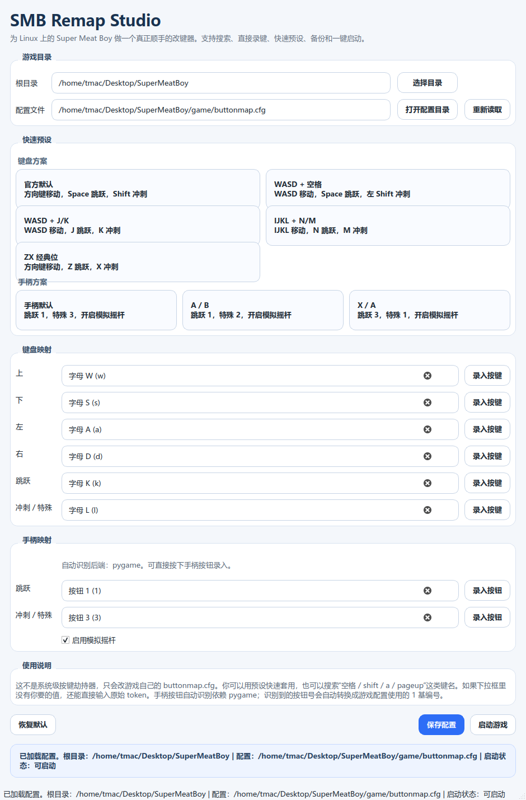

# SMB Remap Studio

非官方的 `Super Meat Boy` 桌面版改键工具，基于 `Python + PySide6`。

支持 `Linux` 和 `Windows`。它不是系统级键盘 Hook，也不会改系统全局按键行为。
它只负责读写游戏自己的 `buttonmap.cfg`，因此稳定、直接、可控。



## 亮点

- 中文友好的桌面界面
- 常用键位支持搜索
- 支持直接录入按键，不再手查 token
- 支持手柄按钮自动识别
- 内置多套键盘 / 手柄预设
- 保存前自动备份 `buttonmap.cfg.bak`
- 支持一键启动游戏
- 可打包成单文件 `Linux` / `Windows` 可执行程序

## 原理

`Super Meat Boy` 启动时会读取安装目录内的 `buttonmap.cfg`。

这个工具的工作流程很简单：

1. 找到游戏目录
2. 读取 `buttonmap.cfg`
3. 修改键位后写回文件

因此它不依赖管理员权限，也不需要底层输入法或驱动层操作。

## 适用目录

默认兼容以下布局：

```text
SuperMeatBoy/
├── SMBRemapStudio
├── start.bash
└── game/
    ├── buttonmap.cfg
    ├── amd64/SuperMeatBoy
    └── x86/SuperMeatBoy
```

```text
SuperMeatBoy/
├── SMBRemapStudio.exe
├── SuperMeatBoy.exe
└── buttonmap.cfg
```

也支持把源码仓库放在别处运行，然后在界面里手动选择游戏目录或 `buttonmap.cfg` 所在目录。

## 快速开始

### Linux：直接运行源码

```bash
./setup_remap_tool.sh
./run_remap_tool.sh
```

### Windows：直接运行源码

```powershell
powershell -ExecutionPolicy Bypass -File .\setup_remap_tool.ps1
powershell -ExecutionPolicy Bypass -File .\run_remap_tool.ps1
```

也可以直接运行仓库里的 `setup_remap_tool.cmd` 和 `run_remap_tool.cmd`。

### Linux：打包单文件程序

```bash
./build_standalone.sh
```

### Windows：打包单文件程序

```powershell
powershell -ExecutionPolicy Bypass -File .\build_standalone.ps1
```

生成的 `SMBRemapStudio` / `SMBRemapStudio.exe` 可以直接复制到游戏目录中运行。

## 依赖说明

- `PySide6` 是必需依赖
- `pygame` 是可选依赖，只影响“手柄按钮自动识别”
- 如果 `pygame` 安装失败，你仍然可以正常读取、修改、保存 `buttonmap.cfg`，也可以手动输入手柄按钮编号

## 常见 token

常用键名示例：

- `space`
- `return`
- `shift`
- `rshift`
- `control`
- `rcontrol`
- `alt`
- `ralt`
- `up`
- `down`
- `left`
- `right`
- `a`
- `s`
- `d`
- `1`
- `2`

如果预置列表里没有你想要的值，可以直接手动输入原始 token。

## 手柄按钮自动识别

手柄区的“录入按钮”会等待你按下控制器上的物理按钮，然后自动填入游戏所需的按钮编号。

- 运行时基于 `pygame`
- `pygame` 读到的按钮号是 0 基
- 工具会自动转换成 `Super Meat Boy` 配置使用的 1 基编号

例如 `pygame` 的 `button 0` 会写成游戏配置里的 `1`。

## 截图导出

项目支持离屏导出截图：

```bash
QT_QPA_PLATFORM=offscreen .venv/bin/python smb_remap_tool.py --export-screenshot screenshots/main-window.png --root /path/to/SuperMeatBoy
```

## CI / Release

- GitHub Actions 会在 `Linux` 和 `Windows` 上执行 smoke test 并打包
- 推送 `v*` tag 时，会自动把两个平台的产物上传到 GitHub Release

## 免责说明

- 本项目是非官方辅助工具
- 不附带游戏本体、资源文件或二进制
- `Super Meat Boy` 相关商标与内容归原权利方所有
